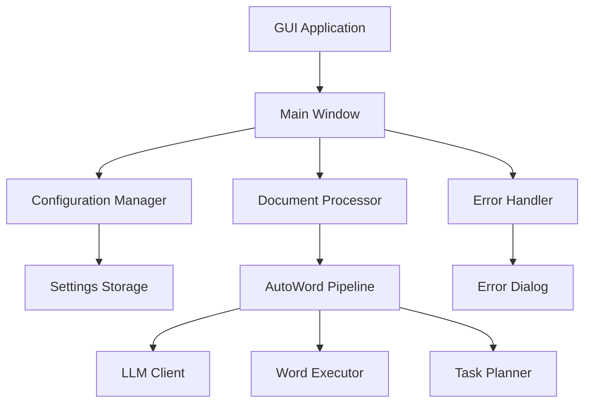

# AutoWord GUI 设计文档

## 概述

为AutoWord文档自动化工具设计一个现代化的图形用户界面，使用PySide6 + qframelesswindow + qdarktheme技术栈。界面采用简洁的设计理念，提供一键式的文档处理体验，最小化用户的操作复杂度。

## 架构

### 技术栈
- **PySide6**: Qt for Python，提供跨平台GUI框架
- **qframelesswindow**: 提供无边框窗口和现代化外观
- **qdarktheme**: 提供深色主题支持
- **AutoWord Core**: 现有的文档处理核心逻辑

### 架构模式
采用MVC（Model-View-Controller）架构模式：
- **Model**: 配置管理、文档处理状态
- **View**: GUI界面组件
- **Controller**: 事件处理和业务逻辑协调



## 组件和接口

### 1. 主窗口 (MainWindow)

**职责**: 应用程序的主界面容器

**接口**:
```python
class MainWindow(QMainWindow):
    def __init__(self)
    def setup_ui(self)
    def setup_connections(self)
    def load_settings(self)
    def save_settings(self)
```

**组件布局**:
- 标题栏（自定义，支持拖拽）
- 配置区域（模型选择、API配置）
- 文件选择区域
- 控制按钮区域
- 进度显示区域
- 日志显示区域

**: 使用qdarktheme提供的深色主题
- **现代化外观**: 无边框窗口，圆角设计，阴影效果
- **响应式布局**: 支持窗口大小调整，组件自适应
- **视觉反馈**: 按钮悬停效果，进度动画，状态指示器

### 颜色方案
- **主色调**: 深蓝色 (#1e1e2e)
- **次要色**: 灰色 (#313244)
- **强调色**: 蓝色 (#89b4fa)
- **成功色**: 绿色 (#a6e3a1)
- **警告色**: 黄色 (#f9e2af)
- **错误色**: 红色 (#f38ba8)

## 实现细节

### 1. 依赖管理
需要添加到requirements.txt的依赖：
```
PySide6>=6.6.0
qframelesswindow>=0.3.0
qdarktheme>=2.1.0
cryptography>=41.0.0  # 用于API密钥加密
```

### 2. 项目结构
```
autoword/
├── gui/
│   ├── __init__.py
│   ├── main_window.py          # 主窗口
│   ├── config_manager.py       # 配置管理
│   ├── processor_controller.py # 处理控制器
│   ├── error_handler.py        # 错误处理
│   ├── progress_widget.py      # 进度组件
│   ├── error_dialog.py         # 错误对话框
│   ├── styles.py               # 样式定义
│   └── resources/              # 资源文件
│       ├── icons/
│       └── styles.qss
├── core/                       # 现有核心模块
└── main_gui.py                 # GUI启动入口
```

### 3. 配置加密
API密钥使用Fernet对称加密存储：
```python
from cryptography.fernet import Fernet
import base64
import os

class SecureConfig:
    def __init__(self):
        self.key = self._get_or_create_key()
        self.cipher = Fernet(self.key)
    
    def _get_or_create_key(self):
        key_file = os.path.expanduser("~/.autoword_key")
        if os.path.exists(key_file):
            with open(key_file, 'rb') as f:
                return f.read()
        else:
            key = Fernet.generate_key()
            with open(key_file, 'wb') as f:
                f.write(key)
            return key
```

### 4. 异步处理
使用QThread进行后台文档处理，避免界面冻结：
```python
class ProcessingThread(QThread):
    progress_updated = Signal(str, float)
    processing_completed = Signal(bool, str)
    error_occurred = Signal(str, str)
    
    def __init__(self, input_path, output_path, config):
        super().__init__()
        self.input_path = input_path
        self.output_path = output_path
        self.config = config
    
    def run(self):
        try:
            # 执行文档处理逻辑
            processor = DocumentProcessor(self.config)
            processor.add_progress_callback(self._on_progress)
            result = processor.process_document(self.input_path)
            
            if result.success:
                self.processing_completed.emit(True, "处理完成")
            else:
                self.error_occurred.emit("ProcessingError", result.error_message)
                
        except Exception as e:
            self.error_occurred.emit("UnexpectedError", str(e))
```

### 5. 国际化支持
预留国际化接口，支持中英文切换：
```python
class I18n:
    def __init__(self, language='zh_CN'):
        self.language = language
        self.translations = self._load_translations()
    
    def tr(self, key: str) -> str:
        return self.translations.get(key, key)
    
    def _load_translations(self):
        # 加载翻译文件
        pass
```

## 性能优化

### 1. 界面响应性
- 使用QThread进行耗时操作
- 实现进度回调，实时更新界面
- 使用QTimer进行定期状态检查

### 2. 内存管理
- 及时释放不需要的对象
- 使用弱引用避免循环引用
- 监控内存使用情况

### 3. 启动优化
- 延迟加载非关键组件
- 使用启动画面提升用户体验
- 缓存配置信息减少I/O操作

## 安全考虑

### 1. API密钥保护
- 使用加密存储API密钥
- 内存中不明文保存密钥
- 应用退出时清理敏感数据

### 2. 文件访问安全
- 验证文件路径合法性
- 检查文件权限
- 防止路径遍历攻击

### 3. 网络安全
- 使用HTTPS进行API调用
- 验证SSL证书
- 实现请求超时和重试机制

## 可扩展性设计

### 1. 插件架构
预留插件接口，支持功能扩展：
```python
class PluginInterface:
    def get_name(self) -> str:
        pass
    
    def get_version(self) -> str:
        pass
    
    def initialize(self, app_context):
        pass
    
    def get_menu_items(self) -> List[MenuItem]:
        pass
```

### 2. 主题系统
支持自定义主题：
```python
class ThemeManager:
    def load_theme(self, theme_name: str):
        pass
    
    def apply_theme(self, theme: Theme):
        pass
    
    def get_available_themes(self) -> List[str]:
        pass
```

### 3. 配置扩展
支持插件配置：
```python
class ConfigExtension:
    def register_config_section(self, section_name: str, schema: Dict):
        pass
    
    def get_config_value(self, section: str, key: str):
        pass
    
    def set_config_value(self, section: str, key: str, value: Any):
        pass
```

## 部署和分发

### 1. 打包方案
使用PyInstaller创建独立可执行文件：
```python
# build_gui.spec
a = Analysis(
    ['main_gui.py'],
    pathex=[],
    binaries=[],
    datas=[('autoword/gui/resources', 'autoword/gui/resources')],
    hiddenimports=['PySide6', 'qframelesswindow', 'qdarktheme'],
    hookspath=[],
    hooksconfig={},
    runtime_hooks=[],
    excludes=[],
    win_no_prefer_redirects=False,
    win_private_assemblies=False,
    cipher=None,
    noarchive=False,
)

pyz = PYZ(a.pure, a.zipped_data, cipher=None)

exe = EXE(
    pyz,
    a.scripts,
    a.binaries,
    a.zipfiles,
    a.datas,
    [],
    name='AutoWord',
    debug=False,
    bootloader_ignore_signals=False,
    strip=False,
    upx=True,
    upx_exclude=[],
    runtime_tmpdir=None,
    console=False,
    disable_windowed_traceback=False,
    argv_emulation=False,
    target_arch=None,
    codesign_identity=None,
    entitlements_file=None,
    icon='autoword/gui/resources/icons/app.ico'
)
```

### 2. 安装程序
使用NSIS创建Windows安装程序，支持：
- 自动安装依赖
- 创建桌面快捷方式
- 注册文件关联
- 卸载功能

### 3. 自动更新
实现自动更新机制：
```python
class UpdateManager:
    def check_for_updates(self) -> Optional[UpdateInfo]:
        pass
    
    def download_update(self, update_info: UpdateInfo):
        pass
    
    def apply_update(self):
        pass
```

## 监控和日志

### 1. 应用监控
- 记录应用启动和关闭时间
- 监控内存和CPU使用情况
- 记录用户操作统计

### 2. 错误追踪
- 自动收集崩溃报告
- 记录详细的错误堆栈
- 支持用户反馈提交

### 3. 性能分析
- 记录处理时间统计
- 分析瓶颈操作
- 优化建议生成

这个设计文档提供了完整的GUI实现方案，确保了功能完整性、用户体验和技术可行性。